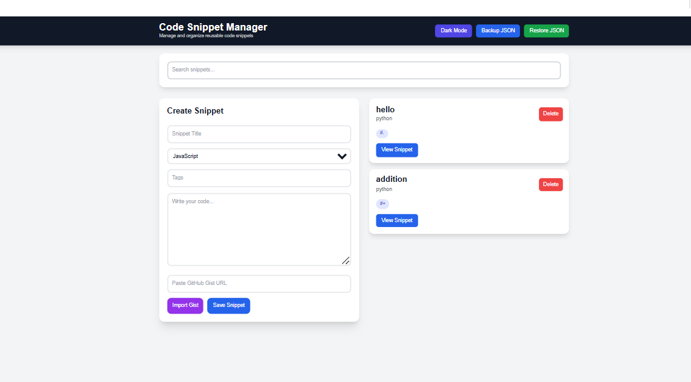
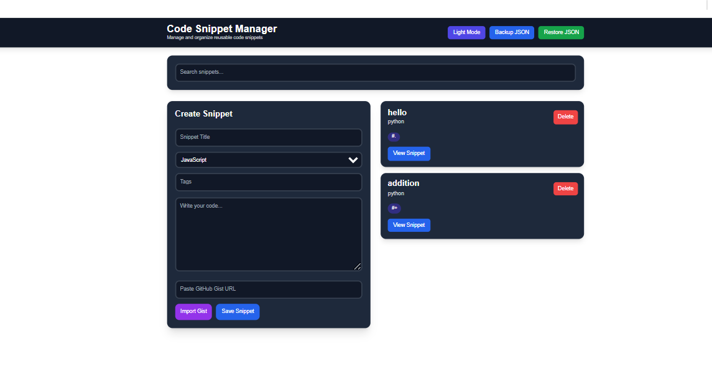
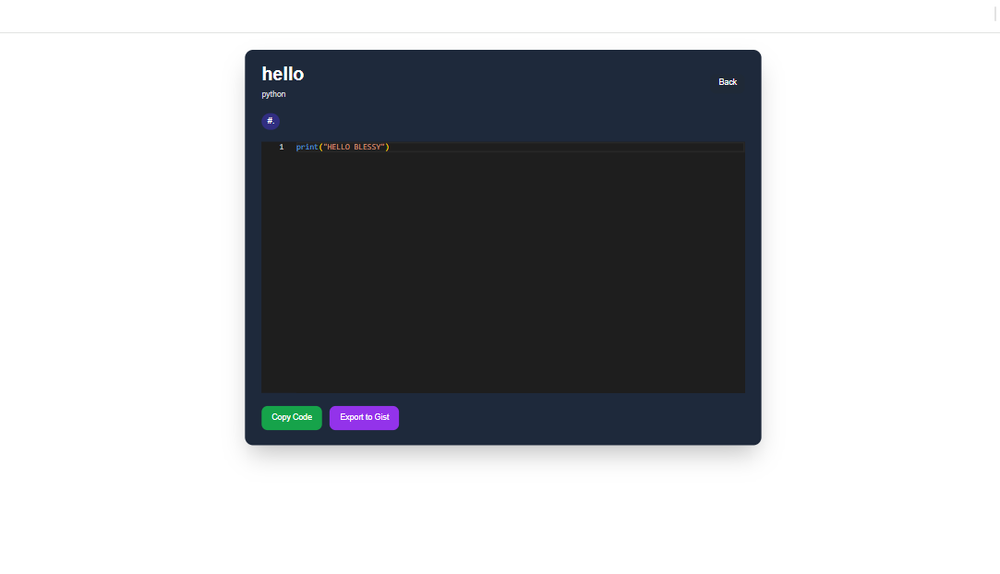
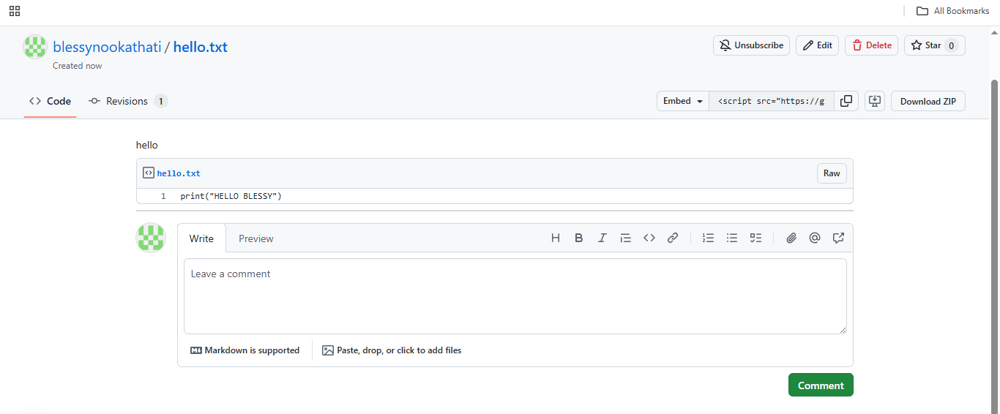

# Code Snippet Manager

A production-ready Code Snippet Manager built with React, Vite, Monaco Editor, and Tailwind CSS. This application allows developers to create, manage, search, filter, backup, restore, import, and export reusable code snippets with a clean and modern UI.

The project demonstrates frontend architecture, routing, API integration, Docker containerization, localStorage persistence, responsive design, and professional UI development.

---

# Live Demo

https://codesnippetmanagerversal.vercel.app/

---

# GitHub Repository

https://github.com/blessynookathati/code_snippet_manager.git

---

# Features

## Core Features
- Create code snippets
- View snippets individually
- Delete snippets
- Search snippets by title or content
- Filter snippets using tags
- Persistent storage using localStorage

## Monaco Editor Features
- Syntax highlighting
- Multi-language support
- Professional coding experience

## GitHub Gist Features
- Export snippets to GitHub Gist
- Import snippets from GitHub Gist URL

## Additional Features
- Dark/Light mode toggle
- Copy code to clipboard
- Backup snippets as JSON
- Restore snippets from JSON
- Responsive modern UI
- React Router navigation
- Docker support

---

# Tech Stack

## Frontend
- React
- Vite
- React Router DOM

## Styling
- Tailwind CSS

## Editor
- Monaco Editor

## APIs
- GitHub Gist API

## State Management
- React Context API

## Deployment
- Vercel
- Docker

---

# Project Structure

```bash
code_snippet_manager/
│
├── public/
│
├── src/
│   ├── components/
│   │   ├── Header.jsx
│   │   ├── SearchBar.jsx
│   │   ├── SnippetForm.jsx
│   │   └── SnippetList.jsx
│   │
│   ├── context/
│   │   └── SnippetContext.jsx
│   │
│   ├── pages/
│   │   └── SnippetView.jsx
│   │
│   ├── App.jsx
│   ├── main.jsx
│   └── index.css
│
├── .env.example
├── Dockerfile
├── docker-compose.yml
├── package.json
└── README.md
```

---

# Installation

## Clone Repository

```bash
git clone https://github.com/blessynookathati/code_snippet_manager.git
```

## Navigate Into Project

```bash
cd code_snippet_manager
```

## Install Dependencies

```bash
npm install
```

## Run Development Server

```bash
npm run dev
```

Open browser:

```bash
http://localhost:5173
```

---

# Environment Variables

Create a `.env` file in the project root.

```env
VITE_GITHUB_TOKEN=your_github_token
```

---

# GitHub Token Setup

1. Go to GitHub Developer Settings
2. Generate a Personal Access Token (Classic)
3. Enable only:
   - gist
4. Copy the generated token
5. Paste it inside `.env`

Example:

```env
VITE_GITHUB_TOKEN=github_pat_xxxxxxxxxxxxx
```

---

# Docker Setup

## Build and Run Container

```bash
docker-compose up --build
```

Open browser:

```bash
http://localhost:5173
```

---

# Dockerfile

```dockerfile
FROM node:20-alpine

WORKDIR /app

COPY package*.json ./

RUN npm install

COPY . .

EXPOSE 5173

CMD ["npm", "run", "dev", "--", "--host"]
```

---

# docker-compose.yml

```yaml
version: "3.9"

services:
  snippet-manager:
    build: .
    ports:
      - "5173:5173"
    env_file:
      - .env
```

---

# Available Scripts

## Start Development Server

```bash
npm run dev
```

## Build Production Application

```bash
npm run build
```

## Preview Production Build

```bash
npm run preview
```

---

# Application Workflow

1. User creates a code snippet
2. Snippet data is stored in localStorage
3. Monaco Editor displays syntax-highlighted code
4. Users can search and filter snippets
5. Snippets can be copied, imported, exported, backed up, or restored
6. React Router enables viewing individual snippets

---

# Main Functionalities

## Create Snippet
Users can create snippets using:
- Title
- Language
- Tags
- Code content

## Search Snippets
Search snippets by:
- Snippet title
- Code content

## Tag Filtering
Filter snippets by clicking tags.

## Monaco Editor
Monaco Editor provides:
- Syntax highlighting
- Professional coding environment
- Multi-language support

## Copy to Clipboard
Users can instantly copy code snippets.

## GitHub Gist Integration
Users can:
- Export snippets to GitHub Gist
- Import snippets using public Gist URLs

## Backup & Restore
Users can:
- Download all snippets as JSON
- Restore snippets from backup JSON

---

# Screenshots

## Light Mode Dashboard



---

## Dark Mode Dashboard



---

## Monaco Editor Snippet View



---

## GitHub Gist Export



---

# Key Learning Outcomes

- React component architecture
- State management using Context API
- React Router navigation
- Monaco Editor integration
- GitHub API integration
- Docker containerization
- localStorage persistence
- Responsive UI design
- Environment variable handling
- Modern frontend development practices

---

# Future Improvements

- User authentication
- Cloud database integration
- AI-powered code suggestions
- Snippet sharing system
- Favorites/bookmarks
- Theme customization
- Folder organization

---

# Deployment

## Vercel Deployment Steps

1. Push project to GitHub
2. Open Vercel
3. Import GitHub repository
4. Add environment variable:

```env
VITE_GITHUB_TOKEN=your_token
```

5. Deploy project

---

# Mentor Explanation

## What is this project?
This is a production-ready code snippet manager where developers can create, store, manage, search, filter, backup, restore, and share reusable code snippets.

## Workflow
Users create snippets with title, language, tags, and code. Snippets are stored in localStorage. Monaco Editor provides syntax highlighting and professional code editing. Users can also import/export GitHub Gists and backup snippets as JSON.

## Why this project?
This project demonstrates frontend architecture, routing, API integration, Dockerization, responsive design, persistence handling, and professional UI development.

---

# Author

Blessy Nookathati

---

# License

This project is created for educational and portfolio purposes.